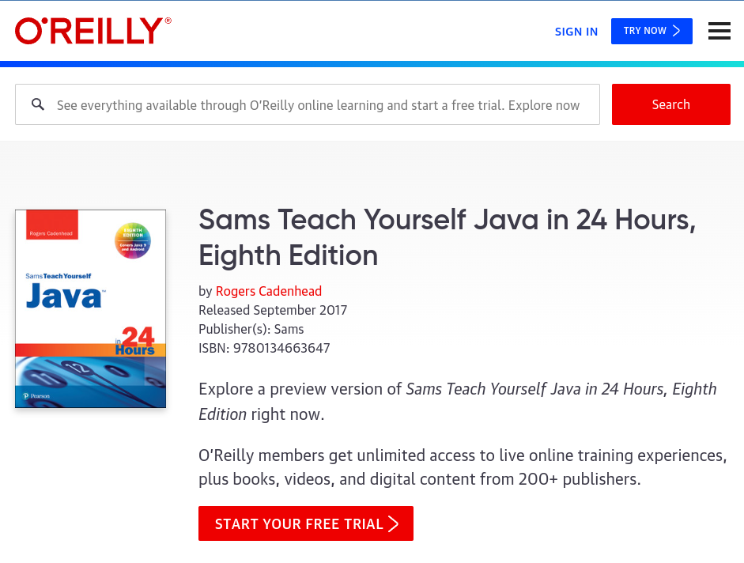

# JDK Documentation

Keep your Java cup full with [Docks](https://docs.oracle.com/en/java/index.html).

The ultimate reference guide: [Java24](https://www.oreilly.com/library/view/sams-teach-yourself/9780134663647/).

**This is the book that I'm using to refresh myself in Java.**

## Java refresher
### Part 1: Getting Started
Becoming a programmer

---
*Hidden Jemz*\
April 11, 2022

